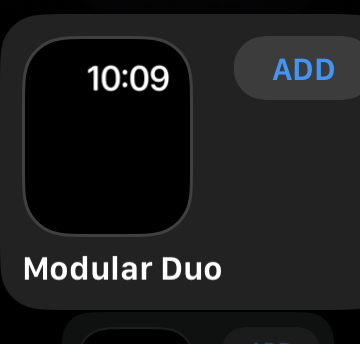
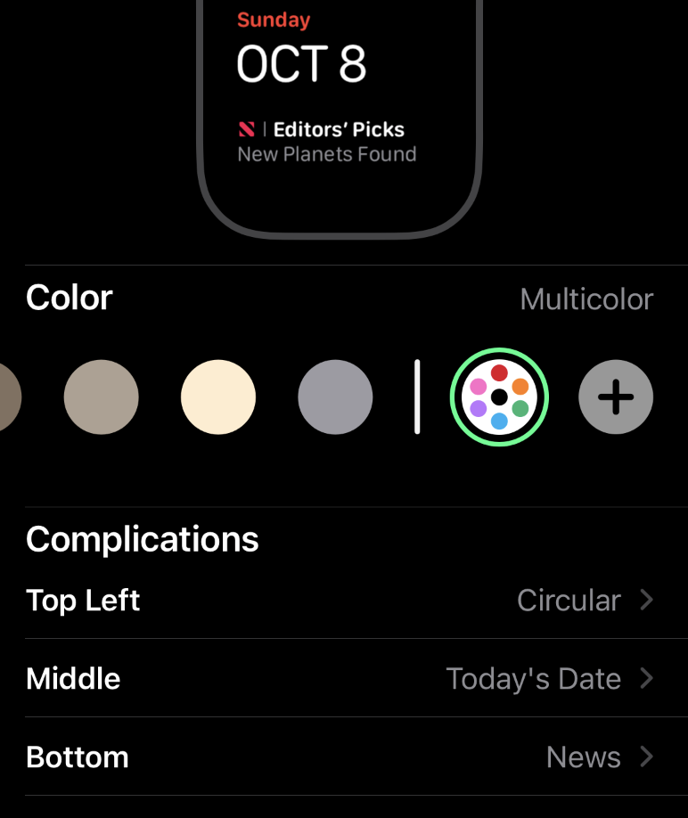
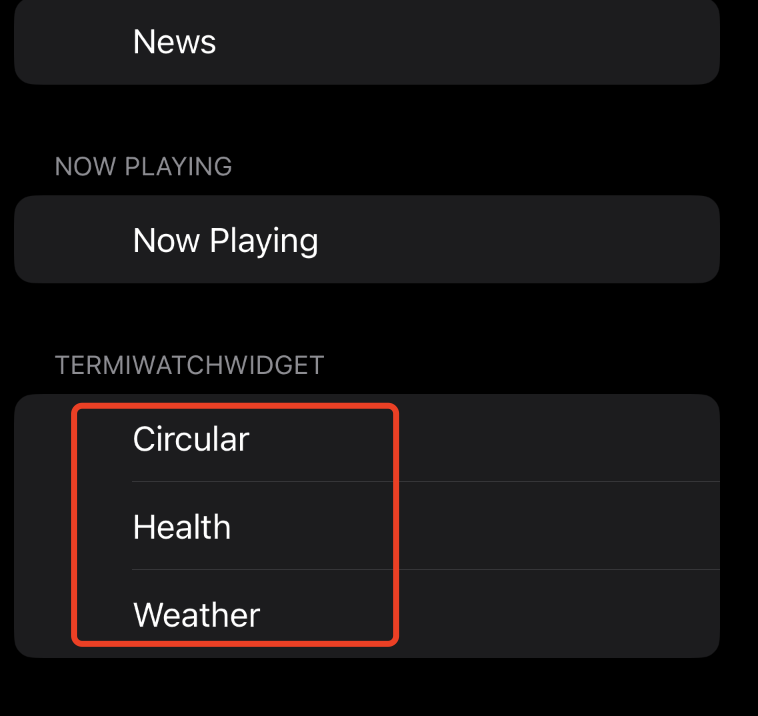

# Terminal Watch Widget

Terminal Watch Widget Face for Apple Watch.

For devices running watchOS 10 or higher.

Due to the fact that the new version of watchOS no longer supports app persistence,   

here we use widgets to achieve a Watch Face similar to the Terminal effect

Thank for TermiWatch https://github.com/kuglee/TermiWatch/

# How to install

## Prerequisites && Adding a developer account to Xcode
  Refer to TermiWatch's tutorial
  - *TermiWatcht* https://github.com/kuglee/TermiWatch/blob/master/README.md
## Configuring the project
  1. Download the latest version:
  - **Xcode 11 or later**: https://github.com/qianlishun/TermiWatchWidget/archive/refs/heads/main.zip
  1. Open **TermiWatchWidget.xcodeproj** in **Xcode**.
  1. Xcode Settings:
      1. Select the project in the **Project Navigator**.
      1. Click the **Show project and targets list** button in the top left corner.
      1. Select the **General** tab:  
      
      1. For each of the 3 **targets** replece *kuglee* in the **Bundle Identifier** field with the name of your developer account. (The name of your Apple ID without the *@xxxx.com*.)
      1. Change the project's team:
          1. Select the **Signing & Capabilities** tab:    
          1. For each of the 3 **targets** change the **Team** to your team. (Usually this is your name.)  
      1. Manually replace bundle identifiers:
            1. Select **Xcode** menu -> **Find** -> **Find and Replace in Project…**.
            1. In the **Text** field type *void* (Maybe others like *xxx* in com.xxx.TermiWatch)
            1. In the **With** field type the name of your developer account. (The name of your Apple ID without the @xxxx.com.)
            1. Click the **Replace All** button.  
      1. If there is an error in WeatherKit or HealthKit, please set Capability
      .

## Installing the app
  1. Plug your phone into your computer.
  1. Unlock your phone and trust your computer.
  1. Select **Xcode** menu -> **Product** -> **Destination**. At the **Device** section select your phone.
  1. Select **Xcode** menu -> **Product** -> **Run**.
  1. Wait for the app to install on your phone.
  1. Go to **Settings** -> **General** -> **Profiles & Device Management** on your phone to trust the app.
  1. Install the watchOS app from the **Watch** app.

## Watch Settings
  1. Open Face Gallery Find and add Modular Duo Face  
  
  2. Set Complications, Set these 3 options  
  
  3. Find TerminalWatchWidget, And set Top Left(Circular), Middle(Weather), Bottom(Health)  
  

