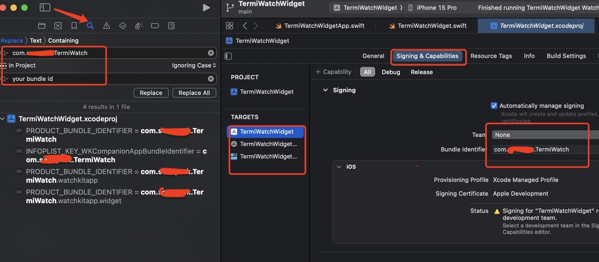

# Terminal Watch Widget
[中文说明](https://github.com/qianlishun/TermiWatchWidget/wiki/中文说明)

Terminal Watch Widget Face for Apple Watch.

For devices running watchOS 10 iOS17 or higher.

Due to the new version of WatchOS not supporting app resident foreground display,

here we use widgets to achieve a Watch Face similar to the Terminal effect.

Thanks for TermiWatch https://github.com/kuglee/TermiWatch/

# Future
Use **WeatherKit** to obtain weather information. **WeatherKit** only supports **paid developer accounts**.  
~Next, I will add other methods to obtain weather data.~  
**qweather** has been introduced, and you can apply for a Key to replace the WeatherKit yourself.  https://dev.qweather.com/en/

# How to install

## Prerequisites && Adding a developer account to Xcode
  Refer to TermiWatch's tutorial
  - *TermiWatcht* https://github.com/kuglee/TermiWatch/blob/master/README.md

  1. Xcode Settings Tips  
      
    1. Project file navigator  
    2. Find navigator  
    3. Project main file, click to display the project settings window on the right  
    4. Targets. Click on different targets to modify their settings  
    5. Schemes. Switch the schemes to compile apps for iPhone or Watch

  2. For each of the 3 **targets** replece *void* in the **Bundle Identifier** field with the name of your developer account. (The name of your Apple ID without the *@xxxx.com*.)  
  
  
  ***
      
  3. Change the project's team:
      1. Select the **Signing & Capabilities** tab:    
      1. For each of the 3 **targets** change the **Team** to your team. (Usually this is your name.)  
  4. Manually replace bundle identifiers:
        1. Select **Xcode** menu -> **Find** -> **Find and Replace in Project…**.
        1. In the **Text** field type *void* (Maybe others like *xxx* in com.xxx.TermiWatch)
        1. In the **With** field type the name of your developer account. (The name of your Apple ID without the @xxxx.com.)
        1. Click the **Replace All** button.
  5. If there is an error in WeatherKit or HealthKit, please set Capability. If you do not use WeatherKit, you do not need to set up WeatherKit.  
  

***

 log in to the developer page  https://developer.apple.com/account , certificate->Identifiers，Find the corresponding bundleID.  
Click to enter, Capabilities -> find WeatherKit and HealthKit ☑️，in App Services find WeatherKit ☑️  
     
  
***

  6. Added **qweather** module, If using 'qweather' to replace weatherkit https://dev.qweather.com/en/docs/
      1. Go to https://id.qweather.com/#/login to apply for the API Key for qweather  
      1. Refer doc https://dev.qweather.com/en/docs/configuration/project-and-key/
      1. Copy **Key** to **HFWeatherKey**  (/TermiWatchWidget/QConfiguration.swift)
      1. Please delete the **Weatherkit** for each of the 3 **targets**  
      

## Installing the app
  1. Watch and iPhone Go to **Settings** -> **Privacy and Security** -> open **Developer Mode** 
  1. Plug your phone into your computer.
  1. Unlock your phone and trust your computer.
  1. Two ways  
    1. Select **Xcode** menu -> **Product** -> **Scheme**, select **TermiWatchWdiget**, -> **Destination** select your phone.  
    2. Select **Xcode** menu -> **Product** -> **Run**.  
    3. Wait for the app to install on your phone.  
    4. Select **Xcode** menu -> **Product** -> **Scheme**, select **TermiWatchWdiget Watch App**, **Product** -> **Destination** select your watch.    
    5. Select **Xcode** menu -> **Product** -> **Run**.  
    6. Wait for the app to install on your watch.   
  1. Or  
    1. Select **Xcode** menu -> **Product** -> **Destination**. At the **Device** section select your phone.  
    2. Select **Xcode** menu -> **Product** -> **Run**.  
    3. Wait for the app to install on your phone.  
    4. iPhone Go to **Settings** -> **General** -> **Profiles & Device Management** on your phone to trust the app.  
    5. Install the watchOS app from the **Watch** app.  
  1. If  **Device** If the device list does not display 'watch', check if the network connection is on the local area network. If it does not work, restart the phone
## Watch Settings
  1. Open this App on iPhone, click **"Sync Watch Face"**.  
  1. Check "My Faces", select and set it.

## Custom UI
  1. Find /TermiWatchWidget/QConfiguration.swift, modify text, color. 
  1. Image path on TermiWatchWidget/TermiWatchWidget_Widget/Assets.xcassets/LeftTopImage.imageset, you can replace it
  1. More custom go to /TermiWatchWidget Watch App/View/QCommonView.swift

### Possible defects
  1. Due to the refresh mechanism of Widges, there is a limit on the number of daily updates, and there may be a lag in data updates.
